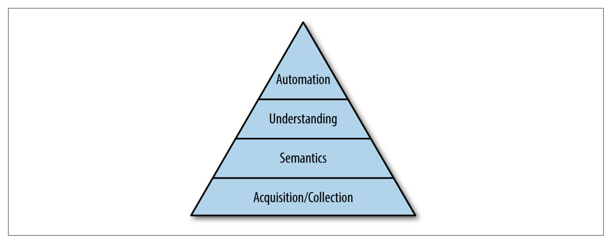

# 数据聚合

> Data integration means making available all the data that an organization has to all the
> services and systems that need it.

数据聚合意味着一个机构所有的数据对所有需要数据的服务和系统可用。

数据聚合可以认为是更泛化的 ETL(extract, transform and load)，相比于 ETL，数据聚合
以实时系统和流式处理为中心。

最基础的是数据收集，将各种来源的数据放在一个可处理的环境，接着对数据进行语义化(semantics) 处理，能被统一化和模型化，接着才是能在其之上实现更高的目标。

## 两大难题

### 数据越来越多样化

从传统的易于在关系型数据库建模的数据（这些数据大部分记录事情状态，是什么），
转变成记录事件发生，即“事件”，例如 web 页面中记录用户活动数据，这些事件更像是
Log。

因为 web 公司中数字化程度最高，所以这个趋势在 web 公司中最为明显，随着射频技术和物联网
的普及，越来越多的商业领域会发现面临记录“事件”数据的挑战。

### 专用数据系统爆炸式增长

越来越多的专业数据系统出现，这些系统被用于 OLAP，搜索，简单的在线存储，批处理和图像分析等，
越来越多的数据和各种各样的数据系统导致数据聚合难度越来越大。

## Log-Structured DataFlow

如何处理上面两个难题？

> Take all of the organization’s data and put it into a central log for real-time subscription

把一个组织的所有数据放入一个实时订阅的中央 Log

程序间数据传递模型如下

数据源(Data Source)可以是鼠标点击或浏览网页，或者是数据库中记录变更的某张表。
每个订阅系统尽可能快地从 log 中读取应用新记录。

这样的好处在于 log 充当了数据生产者和消费者之前的缓冲，允许生产者和消费者以不同速率处理数据，也允许多个不同处理速率的消费者，甚至允许消费者崩溃离线后重新跟上。另一个好处在于生产者和消费者解耦，可以在不改变管道的情况下添加移除消费者。

使用 log 而不是 messaging system 或“发布订阅”是因为这里更侧重持久化和顺序，在分布式社区中也被称为原子化广播(atomic broadcast)。

