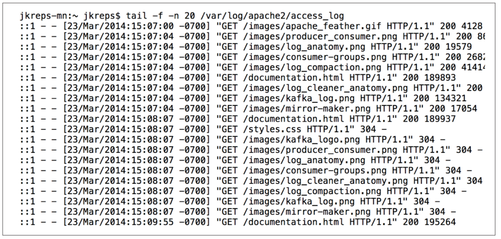
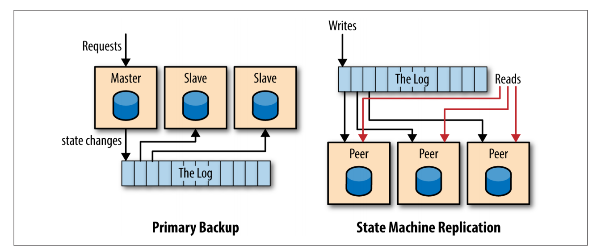

# 导言

## 什么是 Log ?

常见 log 

> a series of loosely structured requests, errors, or other messages in a sequence of rotating text files

包含一连串松散结构（即强制结构）的请求，错误或其他信息的文本文件

随着越来越多的服务或机器使用 log, log 逐渐被用于快速查询和图表化显示不同机器的行为，这时候英语不是很适用于结构化日志。

这里要讨论的日志更接近于 `commit log` 或 `journal`，一种以时间排序，只追加的序列化记录。

日志以写入顺序从0开始标记, 每个记录都有一个唯一标记；从左向右读，记录格式可以是普通文本，也可以是二进制数据。

> A log is not all that different from a file or a table. A file is an array of bytes, a table is
> an array of records, and a log is really just a kind of table or file where the records are
> sorted by time.

> However, it is important that we think about the log as an
> abstract data structure, not a text file.

> The answer is that logs have a specific purpose: they record what happened and
> when. For distributed data systems this is, in many ways, the very heart of the problem.

## 数据库中的 Log

数据库系统在很早之前就使用 log, 数据库向 log 写入数据库中各种记录变更信息，用于在不同备份之前同步数据，且由于 log 会被立即持久化，log 被用于数据库灾备恢复。

数据库 log 两个主要作用

1. 在发布/消费模式下向其他副本传输数据
2. 保证不同副本间变更一致性的机制

## 分布式系统中的 Log

分布式系统的一个基础问题是数据一致性原则，根据“状态机复制原则(state machine replication principle)”

> If two identical, deterministic processes begin in the same state and get the same inputs
> in the same order, they will produce the same output and end in the same state.

即如果两个相同的状态机以相同的状态开始，以相同的顺序获取相同输入，那么他们将会产生相同输出并停止于相同状态。

`Deterministic` 要求系统非时间依赖且不会让其他外界输入影响结果。例如一个基于 `gettimeofday()` 函数做决定的程序就不是一个 `Deterministic` 程序。

如果能保证状态机相同且处于相同起始状态，只要我们向两个状态机以同样顺序输入相同数据，那我们就能保证两个状态机完全一致。

log 正是“相同顺序相同输入”的保证。

## 以 Log 为中心设计的多样性

根据 log 内容，以 log 为中心的设计可以有多种应用方式。比如记录服务的请求并让其他副本独立地处理这些请求，或者记录请求导致的数据变化，甚至记录处理请求的 x86 指令集。

物理或基于行的记录代表记录每个变化行的内容，逻辑或命令式记录代表记录导致记录变化的 SQL 语句。

分布式系统常见两种复制模式

1. 主备模式，由一个推选而来的主节处理所有请求，并将这些请求按顺序写入 log，其他副本应用 log 中的状态变化以便和主节点同步。

2. 状态机模式(或多主模式), 每个节点都是对等的，写入请求首先会被写入 log 然后所有节点根据 log 中顺序依次应用这些写入请求。

## 例子

TODO　写完例子

## Log 和共识

> The log will become something of a commoditized interface, with many algorithms and implementations competing to provide the best guarantees and optimal performance

